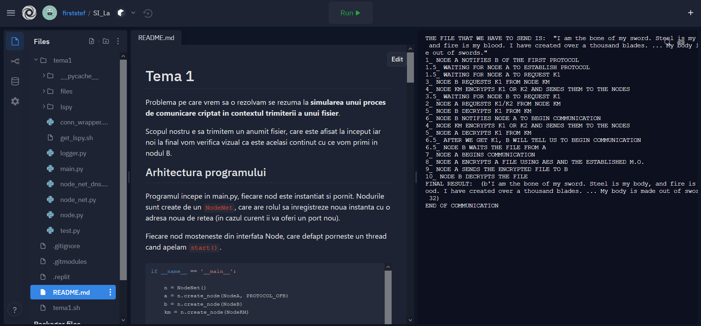

# Tema 1

ATENTIE! Pentru eficienta si ca sa rulati programul fara configuratii dificile va rog vizitati adresa:
<https://repl.it/@firststef/SILa> .La aceasta adresa este configurat proiectul pe un vm online care poate afisa si rula codul sursa.



Problema pe care vrem sa o rezolvam se rezuma la **simularea unui proces de comunicare criptat in contextul trimiterii a unui fisier**.

Scopul nostru e sa trimitem un anumit fisier, care este afisat la inceput iar noi la final vom verifica vizual ca este acelasi continut cu ce vom primi in nodul B.

## Arhitectura programului

Programul incepe in main.py, fiecare nod este instantiat si pornit. Nodurile sunt create de un `NodeNet`, care are rolul sa inregistreze noua instanta cu o adresa noua de retea (in cazul curent ii va oferi un port nou). 

Fiecare nod mosteneste din interfata Node, care defapt porneste un thread cand apelam `start()`. 

```py
if __name__ == '__main__':

    n = NodeNet()
    a = n.create_node(NodeA, PROTOCOL_OFB)
    b = n.create_node(NodeB)
    km = n.create_node(NodeKM)

    log('THE FILE THAT WE HAVE TO SEND IS: ', '"' + open('files/a.txt', 'r').read() + '"')

    a.start()
    b.start()
    km.start()
```

Avem 3 noduri, A, B si KM. Fiecare nod are cel putin constructorul, o metoda `who()` care spune numele nodului respectiv (acest nume e cunoscut de celelalte noduri, dar nu si adresa sa). *Nodurile folosesc un obiect partajat ca un fel de mini-DNS care le spune care este adresa nodului la care ei vor sa se conecteze, exact cum facem si noi cu un DNS - avem doar numele site-ului, si cautam adresa ip.* Metoda `serve()` reprezinta efectiv actiunile pe care le fac nodurile atunci cand sunt pornite.

```py
class NodeA(Node):
    def __init__(self, m_o):
        super().__init__()
        self.ENCRYPTED_KEY = None
        self.SECRET_KEY = None
        self.m_o = m_o

    def who(self) -> str:
        return "A"

    def serve(self):
        log('1_ NODE A NOTIFIES B OF THE FIRST PROTOCOL')
        self.send_to("B", "establish_protocol", encrypt(self.m_o, K3))

        log('2_ NODE A REQUESTS K1/K2 FROM NODE KM')
        self.ENCRYPTED_KEY = self.request_from("KM", "get_key", encrypt("K1" if self.m_o == PROTOCOL_ECB else "K2", K3))
```

Intai de toate trebuie sa explic cum functioneaza comunicarea intre noduri. Fiecare nod joaca fie rolul de **client sau server**, in functie daca vrea sa trimita sau sa primeasca o cerere. 

Interfata `Node` permite claselor derivate sa comunice intre ele prin 3 metode `request_from()` `wait_one()`, si `send_to()`. Acestea sunt o abstractizare pentru protocolul de comunicare `RPC - REMOTE PROCEDURE CALL`. Adica fiecare functie apeleaza o metoda din functionalitatea altui nod. Spre exemplu `send_to("B", "establish_protocol", "ECB")` ar insemna ca apelam metoda establish_protocol din nodul B cu parametrul "ECB". Aceasta metoda salveaza in B protocolul care va fi folosit pentru primirea fisierului din A. Acest mod de comunicare RPC intre noduri a fost o alegere pur de design, nu are rol de a eficientiza sau ceva, am ales pentru ca mie mi se pare codul mai clar de observat in acest mod. 

Privind in detaliu, protocolul RPC este implementat in modulul `lspy`. Am dezvoltat acest modul (nu de la zero, e bazat pe un proiect open-source) intr-un proiect la care am lucrat vara aceasta. In acest modul este o clasa RPC care stie sa primeasca request-uri si sa lege pe acestea de metodele unei clase date ca parametru, cum e in exemplul de mai sus clasa NodeB cu metoda establish_protocol(). 

Metoda `request_one()` este folosita atunci cand vrem sa primim un raspuns de la alt nod, spre exemplu NodeB vrea o cheie de la NodeKM. Metoda `send_to()` e folosita sa semnalam ceva, spre exemplu NodeB semnaleaza lui NodeA sa inceapa comunicarea, neasteptand vreun raspuns. Iar in final, `wait_one()` asteapta o singura cerere de la noduri, dupa care trece mai departe. Folosind aceste 3 metode putem realiza scenariul descris in tema1. Nu voi intra in detaliu legat de implementarea din spate, dar aceasta se afla in `node.py` si `lspy.py`.

## Functiile de encriptie

```py
def encrypt(message, key: bytes):
    key = pad(key, 16)
    message = pad(message, 16)
    cip = AES.new(key, AES.MODE_ECB)
    return cip.encrypt(message)


def decrypt(cr: bytes, key: bytes):
    key = pad(key, 16)
    cip = AES.new(key, AES.MODE_ECB)
    return unpad(cip.decrypt(cr), 16)


def ecb_encrypt(text, key: bytes, chunk_size):
    pad(text, chunk_size)
    chunks = split_into_chunks(text, chunk_size)
    encrypted_chunks = [encrypt(chunk, key) for chunk in chunks]
    return b''.join(encrypted_chunks), len(encrypted_chunks[0])


def ecb_decrypt(file, key, chunk_size):
    chunks = split_into_chunks(file, chunk_size)
    return b''.join([decrypt(chunk, key) for chunk in chunks])


def ofb_encrypt_decrypt(text, key: bytes, chunk_size, iv):
    chunks = split_into_chunks(text, chunk_size)
    ciphertext = pad(iv, OFB_BLOCK_SIZE)
    out_chunks = []
    for chunk in chunks:
        ciphertext = encrypt(ciphertext, key)[:OFB_BLOCK_SIZE]
        out_chunks.append(xor_bytestrings(ciphertext, chunk))
    return b''.join(out_chunks), len(out_chunks[0])
```

Pentru functiile de encriptie am folosit in primul rand AES implementat in libraria `pycryptodome`. Functiile encrypt si decrypt (de)padeaza textul si cheia si cripteaza basic folosind AES. Dar implementarile pentru ECB si OFB sunt in `ecb_encrypt()`, `ecb_decrypt()`, `ofb_encrypt_decrypt()`.

Pentru ECB encrypt, am impartit textul meu in chunk-uri de aceeasi marime si am criptat pe fiecare separat, iar la final le-am lipit. Pentru decrypt procesul exact invers. 

Pentru OFB am luat iv-ul, l-am pad-at, am criptat cu cheia ciphertext-ul curent stiindu-l pe cel precedent, si, secvential, am trecut secvential prin chunk-uri si am facut XOR intre ele si ciphertext-ul. La final am lipit chunk-urile. Pentru decriptare se foloseste exact aceeasi functie.

## Scenariul programului

Am pus in cod, cu indecsi, pasii logici ai scenariului. Executia efectiva a scenariului incepe pentru fiecare nod in metoda `serve()`. Spre exemplu, in nodul A:

```py
    def serve(self):
        log('1_ NODE A NOTIFIES B OF THE FIRST PROTOCOL')
        self.send_to("B", "establish_protocol", encrypt(self.m_o, K3))

        log('2_ NODE A REQUESTS K1/K2 FROM NODE KM')
        self.ENCRYPTED_KEY = self.request_from("KM", "get_key", encrypt("K1" if self.m_o == PROTOCOL_ECB else "K2", K3))

        log('5_ NODE A DECRYPTS K1 FROM KM')
        # delayed to begin phase

        log('6.5_ AFTER WE GET K1, B WILL TELL US TO BEGIN COMMUNICATION')  # SO EXECUTION MOVES TO THE BEGIN METHOD
        self.wait_one()
```

Dupa cum se poate vedea, pentru fiecare adnotare este o actiune corespondenta a nodului respectiv, de exemplu la inceput nodul A vrea sa ii spuna nodului B protocolul - facem asta cu metoda `send_to()` pentru ca este o notificare, nu vrem un raspuns inapoi. Pasii nu sunt in ordine pentru ca focus-ul logicii executiei se muta si la nodul B. Mai sus singurul aspect care nu a fost explicat este de ce la 5 se spune `delayed to begin phase`. In acel loc alegem sa amanam decriptarea cheii primite pana cand B activeaza inceperea comunicarii, ca nu cumva nodul A sa fie ocupat si intre timp nodul B sa incerce sa se conecteze (decriptarea este sincron). Fiecare metoda si pas au fost adnotate cu comentarii care explica la ce folosesc. 

## Output-ul programului:

```
THE FILE THAT WE HAVE TO SEND IS:  "I am the bone of my sword. Steel is my body, and fire is my blood. I have created over a thousand blades. ... My body is made out of swords."
1_ NODE A NOTIFIES B OF THE FIRST PROTOCOL
1.5_ WAITING FOR NODE A TO ESTABLISH PROTOCOL
1.5_ WAITING FOR NODE A TO REQUEST K1
2_ NODE A REQUESTS K1/K2 FROM NODE KM
3_ NODE B REQUESTS K1 FROM NODE KM
3.5_ WAITING FOR NODE B TO REQUEST K1
4_ NODE KM ENCRYPTS K1 OR K2 AND SENDS THEM TO THE NODES
5_ NODE B DECRYPTS K1 FROM KM
6_ NODE B NOTIFIES NODE A TO BEGIN COMMUNICATION
4_ NODE KM ENCRYPTS K1 OR K2 AND SENDS THEM TO THE NODES
5_ NODE A DECRYPTS K1 FROM KM
6.5_ AFTER WE GET K1, B WILL TELL US TO BEGIN COMMUNICATION
6.5_ NODE B WAITS THE FILE FROM A
7_ NODE A BEGINS COMMUNICATION 
8_ NODE A ENCRYPTS A FILE USING AES AND THE ESTABLISHED M.O.
9_ NODE A SENDS THE ENCRYPTED FILE TO B
10_ NODE B DECRYPTS THE FILE
FINAL RESULT:  (b'I am the bone of my sword. Steel is my body, and fire is my blood. I have created over a thousand blades. ... My body is made out of swords.', 32)
END OF COMMUNICATION
```

## Teste 

Pentru teste am verificat ca cele 2 criptari sunt valide si pot decripta ceea ce au criptat. Fisier-ul de test poate fi rulat separat, se numeste `test.py`.

```py
class TestEncryptDecrypt(unittest.TestCase):
    def test_ECB(self):
        text = b'fisier1234textvulpeasarepestevizuina'
        key = b'acertainrandomkey'
        enc, chunk_size = main.ecb_encrypt(text, key, main.ECB_BLOCK_SIZE)
        self.assertEqual(main.ecb_decrypt(enc, key, chunk_size), text)

    def test_OFB(self):
        text = b'fisier1234textvulpeasarepestevizuina'
        key = b'acertainrandomkey'
        iv = b'\x01\x02\x03\x04\x05\x06\x07\x08\x09\x0a\x0b\x0c\x0d\x0e\x0f'
        enc, chunk_size = main.ofb_encrypt_decrypt(text, key, main.OFB_BLOCK_SIZE, iv)
        self.assertEqual(main.ofb_encrypt_decrypt(enc, key, chunk_size, iv)[0], text)
```

## Instalare

Veti avea nevoie de Python 3.x. Ca dependinta trebuie sa va instalati `pycryptodome`:
```
pip install pycryptodome
# Rulati cu
export PYTHONPATH=${PWD}:${PWD}/lspy
python3 main.py
```